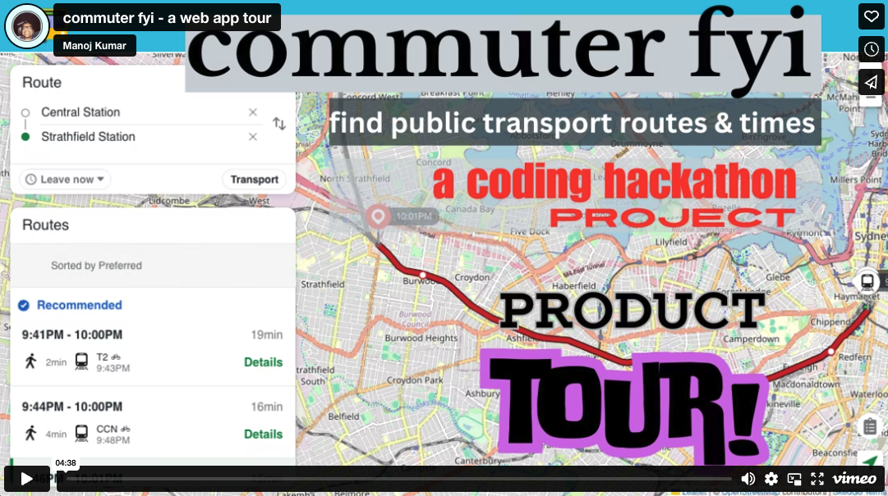

Welcome to **commuter fyi**, a public transport planner app! Seamlessly navigate your city's public transportation system with ease using our intuitive interface. Whether you're commuting solo or in a group, our app provides up-to-the-minute information on predicted departure and arrival times for various modes of transportation, covering over 400 cities and regions worldwide and integrating with 4000+ transport service providers. Plan your journey efficiently and stay informed with our comprehensive public transport planner app.

# Product Tour

Click below to watch!

# How to use the web app

**FYI**: When you land on the page, you will get an alert asking to turn on your location settings. Doing so, allows the map API to determine your country & city, and this allows you to do the following functions easily. Otherwise, you will need to scroll through the map to your country/city first. I recommend turning on the location setting, and once it captures your region, you can turn it off in your browser settings.

**Steps to see your journey details**
<ol>
<li>Visit commuter.fyi</li>
<li>On the homepage map, look for a search box, top-left</li>
<li>Enter your station or suburb of interest</li>
<li>If you need to see departure times between 2 locations, click on the green icon with a white arrow in the search bar, and enter your departure and arrival locations</li>
</ol>

# API powered by
  
**Shaping the global future of mobility and smart cities**  

A massive thanks to Skedgo for providing the TripGo API to power the search results for the transit systems across the world. Skedgo provides award-winning technology that delivers mobility solutions and modules. Clients can create their own customised mobility offering, that covers journey planning, parking, book & pay, events and itineraries. Check out their products, services & technology here: [skedgo.com](https://skedgo.com/)

# The Web App History
This web app was built as a part of a coding course hackathon in May 2024. It was deployed to the world wide web on Thursday, 30 May 2024. Each student, either working solo or in a group, had the opportunity to create something that utilizes React, NodeJS, JavaScript, and an API. I chose to build a public transport timetable app that helps commuters plan their departure & arrival for their chosen locations.

# Tech Stack

This project was created with React, NodeJS and JavaScript. Deployed via GitHub and Netlify.

## Available Scripts

In the project directory, you can run:

### `npm start`

Runs the app in the development mode.\
Open [http://localhost:3000](http://localhost:3000) to view it in your browser.

The page will reload when you make changes.\
You may also see any lint errors in the console.

### `npm test`

Launches the test runner in the interactive watch mode.\
See the section about [running tests](https://facebook.github.io/create-react-app/docs/running-tests) for more information.

### `npm run build`

Builds the app for production to the `build` folder.\
It correctly bundles React in production mode and optimizes the build for the best performance.

The build is minified and the filenames include the hashes.\
Your app is ready to be deployed!

See the section about [deployment](https://facebook.github.io/create-react-app/docs/deployment) for more information.

### `npm run eject`

**Note: this is a one-way operation. Once you `eject`, you can't go back!**

If you aren't satisfied with the build tool and configuration choices, you can `eject` at any time. This command will remove the single build dependency from your project.

Instead, it will copy all the configuration files and the transitive dependencies (webpack, Babel, ESLint, etc) right into your project so you have full control over them. All of the commands except `eject` will still work, but they will point to the copied scripts so you can tweak them. At this point you're on your own.

You don't have to ever use `eject`. The curated feature set is suitable for small and middle deployments, and you shouldn't feel obligated to use this feature. However we understand that this tool wouldn't be useful if you couldn't customize it when you are ready for it.

## Learn More

You can learn more in the [Create React App documentation](https://facebook.github.io/create-react-app/docs/getting-started).

To learn React, check out the [React documentation](https://reactjs.org/).

### Code Splitting

This section has moved here: [https://facebook.github.io/create-react-app/docs/code-splitting](https://facebook.github.io/create-react-app/docs/code-splitting)

### Analyzing the Bundle Size

This section has moved here: [https://facebook.github.io/create-react-app/docs/analyzing-the-bundle-size](https://facebook.github.io/create-react-app/docs/analyzing-the-bundle-size)

### Making a Progressive Web App

This section has moved here: [https://facebook.github.io/create-react-app/docs/making-a-progressive-web-app](https://facebook.github.io/create-react-app/docs/making-a-progressive-web-app)

### Advanced Configuration

This section has moved here: [https://facebook.github.io/create-react-app/docs/advanced-configuration](https://facebook.github.io/create-react-app/docs/advanced-configuration)

### Deployment

This section has moved here: [https://facebook.github.io/create-react-app/docs/deployment](https://facebook.github.io/create-react-app/docs/deployment)

### `npm run build` fails to minify

This section has moved here: [https://facebook.github.io/create-react-app/docs/troubleshooting#npm-run-build-fails-to-minify](https://facebook.github.io/create-react-app/docs/troubleshooting#npm-run-build-fails-to-minify)
